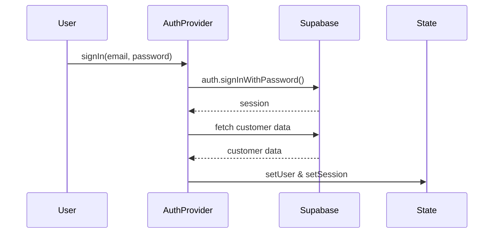
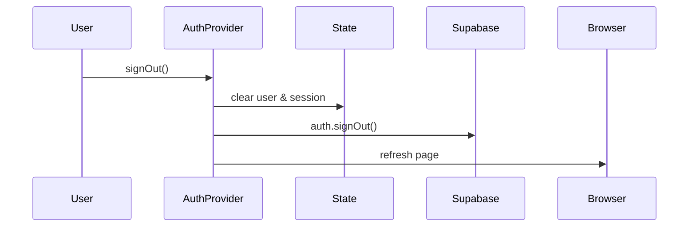
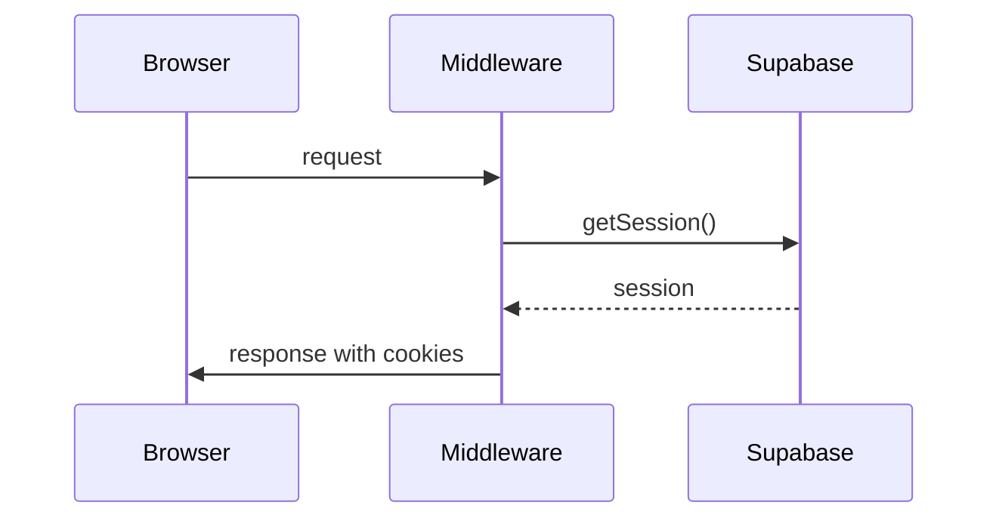

# Flujo de Autenticación en Vino Rodante

## Componentes Principales

### 1. Middleware (`middleware.ts`)
- Se ejecuta en cada request
- Maneja las cookies de sesión
- Verifica el estado de autenticación
- Redirige a login si es necesario

```typescript
// Flujo del middleware
1. Crea una respuesta inicial
2. Inicializa el cliente de Supabase
3. Maneja las cookies (getAll/setAll)
4. Verifica el usuario actual
5. Redirige si es necesario
```

### 2. Cliente de Supabase (`lib/supabase.ts`)
- Cliente del navegador para Supabase
- Maneja las operaciones de autenticación
- No configura cookies (lo hace el middleware)

```typescript
// Configuración del cliente
createBrowserClient(
  process.env.NEXT_PUBLIC_SUPABASE_URL!,
  process.env.NEXT_PUBLIC_SUPABASE_ANON_KEY!
)
```

### 3. AuthProvider (`lib/providers/auth-provider.tsx`)
- Provee el contexto de autenticación
- Maneja el estado de la sesión
- Proporciona métodos de autenticación

```typescript
// Estado principal
const [user, setUser] = useState<User | null>(null)
const [session, setSession] = useState<Session | null>(null)
const [isLoading, setIsLoading] = useState(true)
```

## Flujo de Autenticación

### 1. Inicio de Sesión


### 2. Cierre de Sesión


### 3. Verificación de Sesión


## Manejo de Cookies

### 1. Estructura de Cookies
- `sb-<project-ref>-auth-token`: Token de autenticación
- `sb-<project-ref>-auth-token.sig`: Firma del token

### 2. Ciclo de Vida
1. **Creación**: Al iniciar sesión
2. **Actualización**: En cada request (middleware)
3. **Eliminación**: Al cerrar sesión

### 3. Manejo en Middleware
```typescript
cookies: {
  getAll() {
    return request.cookies.getAll()
  },
  setAll(cookiesToSet) {
    // Actualiza cookies en request y response
  }
}
```

## Puntos de Falla Comunes

### 1. Problemas de Cookies
- **Síntoma**: Sesión perdida al refrescar
- **Causa**: Cookies no sincronizadas entre request/response
- **Solución**: Usar `getAll/setAll` en middleware

### 2. Problemas de Estado
- **Síntoma**: UI inconsistente con estado de auth
- **Causa**: Estado local no sincronizado con Supabase
- **Solución**: Usar `onAuthStateChange`

### 3. Problemas de Redirección
- **Síntoma**: Redirecciones infinitas
- **Causa**: Middleware mal configurado
- **Solución**: Verificar matcher y lógica de redirección

## Debugging

### 1. Logs Clave
```typescript
// En AuthProvider
console.log('[Auth] Initial session:', session)
console.log('[Auth] Auth state changed:', session)
console.log('[Auth] Fetched customer:', { customer, error })

// En Middleware
console.log('[Auth] User in middleware:', user)
```

### 2. Verificación de Estado
1. Revisar cookies en DevTools
2. Verificar estado en React DevTools
3. Comprobar logs en consola

### 3. Herramientas
- Supabase Dashboard: Ver sesiones activas
- DevTools: Network y Application tabs
- React DevTools: Estado del AuthProvider

## Mejores Prácticas

1. **Manejo de Sesión**
   - Usar middleware para cookies
   - Mantener estado local sincronizado
   - Limpiar estado al cerrar sesión

2. **Seguridad**
   - No exponer tokens
   - Usar HTTPS en producción
   - Validar sesiones en servidor

3. **UX**
   - Mostrar estado de carga
   - Manejar errores graciosamente
   - Redirigir apropiadamente

## Troubleshooting

### 1. Sesión Perdida
1. Verificar cookies en DevTools
2. Comprobar logs de middleware
3. Verificar estado en Supabase

### 2. Login Fallido
1. Revisar credenciales
2. Verificar políticas de Supabase
3. Comprobar logs de error

### 3. Estado Inconsistente
1. Limpiar cookies
2. Forzar refresh
3. Verificar sincronización 